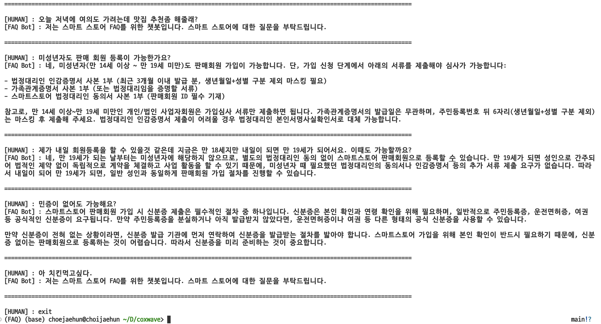

# FAQ_Chatbot
네이버 스마트스토어의 자주 묻는 질문(FAQ)을 기반으로 질의응답하는 챗봇 만들기

---  

### 데모확인

### 실행방법
`mac os에서 개발하였습니다, python 3.10.12. 버전의 conda 환경을 맞춰주세요.`

    $ conda create -n "__your env__" python==3.10.12
    $ conda activate "__your env__"

    $ git clone https://github.com/ash-hun/FAQ_Chatbot.git
    $ cd FAQ_Chatbot
    $ pip install -r requirements.txt
    $ python main.py